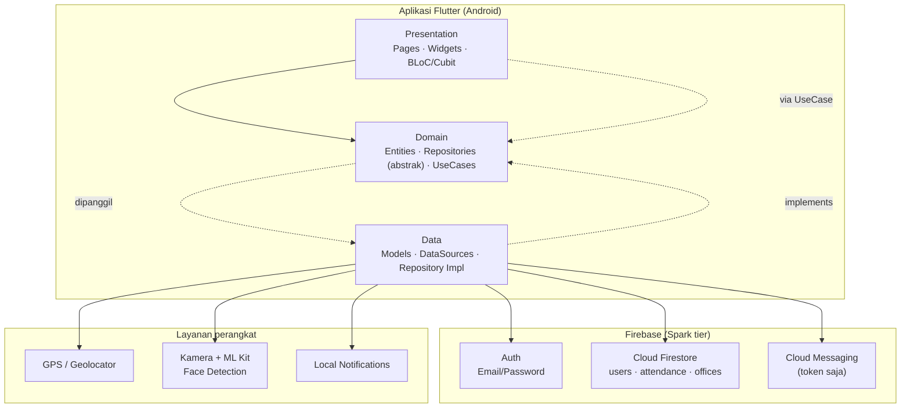
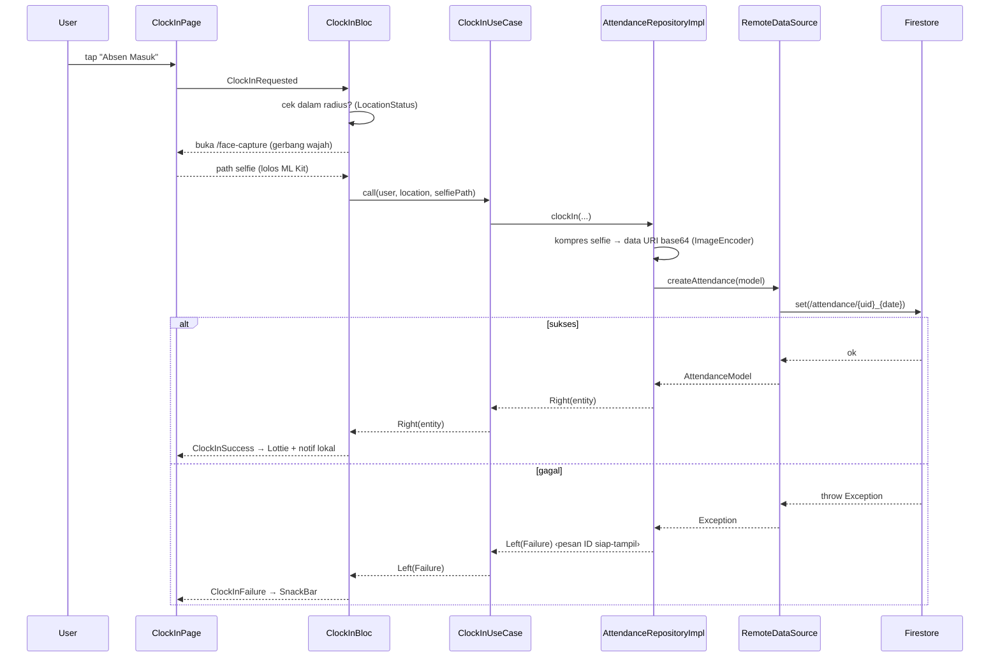

# Arsitektur — Smart Absen

Dokumen ini menjelaskan arsitektur aplikasi: lapisan, aliran data, manajemen
state, dependency injection, navigasi, dan keputusan desain utama.

> Ringkasan: **Flutter + Firebase**, **Clean Architecture** per fitur,
> **BLoC/Cubit** untuk state, **get_it** untuk DI, **go_router** untuk navigasi,
> **dartz `Either`** untuk error handling.

---

## 1. Gambaran umum



Tidak ada backend server kustom. "Backend" = layanan terkelola
(Firebase) + layanan on-device. Logika bisnis ada di klien; integritas data
ditegakkan oleh **aturan keamanan Firestore** (lihat [API.md](API.md#4-model-keamanan-firestore)).

---

## 2. Clean Architecture per fitur

Setiap fitur (`auth`, `attendance`, `face`, `profile`, `admin`) memiliki tiga
lapisan dengan **aturan dependensi satu arah**: Presentation → Domain ← Data.
Domain tidak tahu apa-apa soal Flutter maupun Firebase.

```
lib/features/<fitur>/
├── data/
│   ├── datasources/     # bicara langsung ke Firebase / SDK perangkat → lempar Exception
│   ├── models/          # subclass entity + (de)serialisasi Firestore
│   └── repositories/    # implement kontrak domain, tangkap Exception → Failure
├── domain/
│   ├── entities/        # objek bisnis murni (Equatable), tanpa dependensi luar
│   ├── repositories/    # kontrak abstrak (interface)
│   └── usecases/        # satu aksi bisnis = satu kelas callable
└── presentation/
    ├── bloc/            # BLoC/Cubit: event → state
    ├── pages/           # layar
    └── widgets/         # komponen UI per fitur
```

| Lapisan | Boleh tahu | Tanggung jawab | Contoh |
|---|---|---|---|
| **Presentation** | Domain | render UI, kirim event, tampilkan state | `ClockInBloc`, `DashboardPage` |
| **Domain** | — (murni Dart) | aturan bisnis, kontrak | `AttendanceEntity`, `ClockInUseCase`, `AttendanceRepository` |
| **Data** | Domain | I/O, mapping, error | `AttendanceRemoteDataSource`, `AttendanceModel`, `AttendanceRepositoryImpl` |

### Logika murni yang teruji
Aturan bisnis berat ditarik jadi **fungsi murni** di `domain`/`core` agar mudah
diuji tanpa Firebase: `computeWeeklyStats`, `computeAdminStats`,
`computeClockInHourCounts`, `evaluateFace`, `buildAttendanceCsvRows`,
`haversineMeters`, validator input. Semua punya unit test (48 test).

---

## 3. Aliran data (contoh: Absen Masuk)



**Pola error (wajib):** `datasource lempar Exception` → `repository tangkap & map
ke Failure` → `Either<Failure, T>` ke presentation. UI hanya membaca
`Failure.message` yang sudah berbahasa Indonesia & actionable — tidak ada error
mentah yang bocor.

---

## 4. Manajemen state (BLoC / Cubit)

- **BLoC** untuk alur kompleks dengan banyak event (auth, clock-in, history,
  admin stats, export, dll).
- **Cubit** untuk state sederhana (`ConnectivityCubit` online/offline,
  `SettingsCubit` tema & bahasa).
- State global di-provide di `main.dart` via `MultiBlocProvider`:
  `AuthBloc`, `ConnectivityCubit`, `SettingsCubit`. Bloc per-layar di-provide
  lokal di halamannya.
- **Real-time**: `AdminStatsBloc` memakai `emit.forEach` atas `Stream` snapshot
  Firestore → KPI ter-recompute tiap ada perubahan dokumen.

---

## 5. Dependency Injection (get_it)

`lib/injection_container.dart` mendaftarkan seluruh dependensi. Pola umum:

- **Factory** untuk BLoC (instance baru tiap dibutuhkan).
- **Lazy singleton** untuk repository, datasource, usecase, service, dan
  klien eksternal (`FirebaseAuth`, `FirebaseFirestore`, `Connectivity`).
- Arah wiring: `Bloc → UseCase → Repository(impl) → DataSource → SDK`.

---

## 6. Navigasi & guard peran (go_router)

`lib/core/router/app_router.dart` mendefinisikan rute dan **redirect guard**
berbasis status auth + peran:

| Rute | Layar | Akses |
|---|---|---|
| `/splash` | Splash (cek sesi) | publik |
| `/login`, `/forgot-password` | Auth | publik |
| `/dashboard` | Dashboard karyawan | login |
| `/history`, `/leave`, `/profile` | Karyawan | login |
| `/clock-in`, `/face-capture` | Alur absen | login |
| `/admin` | Panel admin | **admin** |
| `/admin/employees`, `/admin/employee-detail` | Manajemen karyawan | **admin** |

Guard: belum login → `/login`; karyawan membuka `startsWith('/admin')` →
dialihkan ke `/dashboard`; admin diarahkan ke `/admin`. `employee-detail`
menerima `UserEntity` lewat `extra`.

---

## 7. Lapisan `core` (lintas-fitur)

| Folder | Isi |
|---|---|
| `constants/` | `AppColors`, `AppTextStyles`, `AppTheme`, `AppStrings` (i18n), `AppConfig`, `AppLocale` |
| `errors/` | `exceptions.dart` (data), `failures.dart` (siap-tampil) |
| `network/` | `ConnectivityCubit`, `NetworkInfo` (cek koneksi sebelum operasi) |
| `router/` | go_router + guard |
| `services/` | `local_notification_service`, `push_token_service`, `csv_export_service` |
| `settings/` | `SettingsCubit` (tema gelap + bahasa, persist SharedPreferences) |
| `utils/` | `haversine`, `validators`, `image_encoder`, `face_quality`, `date_format_id`, `weekly_stats`, dll. |
| `widgets/` | `OfflineBanner`, tombol & komponen bersama |

---

## 8. Keputusan desain & batasan (Spark tier)

| Keputusan | Alasan |
|---|---|
| **Selfie & foto profil = base64 di Firestore**, bukan Storage | Storage butuh paket Blaze. `ImageEncoder` kompres ≤800px q70 (~40KB) ke field `selfieUrl`/`photoUrl`. |
| **Doc id absensi deterministik `{uid}_{date}`** | Mencegah absen ganda per hari secara atomik. |
| **Query single-field saja** (range `date`, `where userId`) + sort/filter di klien | Hindari composite index Firestore. Paginasi riwayat = lazy render klien. |
| **Login via NIK** | NIK → query email di `/users` → Firebase Auth (email/password). |
| **i18n via flag global + getter** (`AppLocale`), bukan gen-l10n | `Failure`/notifikasi bersifat context-free, tak punya `BuildContext`. |
| **Peta dinonaktifkan** (`AppConfig.mapsEnabled=false`) | Maps SDK belum aktif di GCP → fallback `MapUnavailableView`. |
| **Push hanya lokal** | Server push (Cloud Functions) butuh Blaze; token FCM sudah disimpan. |

Lihat juga: [ER_DIAGRAM.md](ER_DIAGRAM.md) dan [API.md](API.md).
