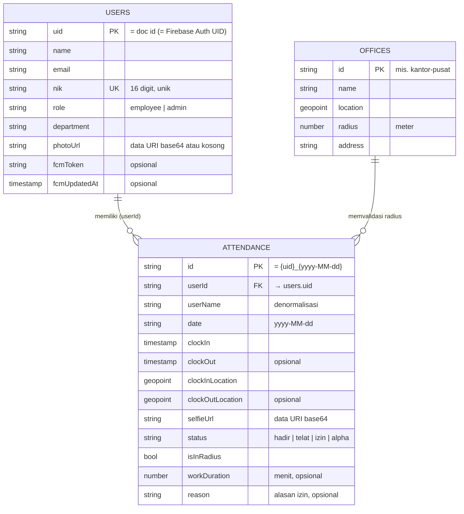

# ER Diagram & Skema Data — Smart Absen

Firestore adalah basis data **dokumen (NoSQL)**, bukan relasional. "ER diagram"
di sini memetakan **koleksi**, **field**, dan **relasi logis** antar dokumen
(relasi ditegakkan oleh konvensi aplikasi & aturan keamanan, bukan foreign key).

---

> **Versi visual (Excalidraw):** [buka & edit di excalidraw.com](https://excalidraw.com/#json=VuWlXz5g9foczI9Y7xpEp,2qcsvCz53faE42gKSH2K4w)
> · sumber offline: [`er-diagram.excalidraw`](er-diagram.excalidraw) (drag ke
> [excalidraw.com](https://excalidraw.com) untuk membuka).

## 1. Diagram relasi

**Relasi:**
- `attendance.userId` → `users.uid` (banyak catatan per user). `userName`
  **didenormalisasi** ke dokumen absensi agar laporan/admin tak perlu join.
- `offices` adalah data acuan; tidak ada FK langsung — clock-in membaca office
  utama untuk menghitung jarak/radius (Haversine).

---

## 2. Koleksi `/users/{uid}`

Profil karyawan. **Doc id = Firebase Auth UID.**

| Field | Tipe | Wajib | Catatan |
|---|---|---|---|
| `uid` | string | ✓ | sama dengan doc id |
| `name` | string | ✓ | nama tampil |
| `email` | string | ✓ | untuk login & lookup |
| `nik` | string | ✓ | 16 digit, dipakai login alternatif (NIK → email) |
| `role` | string | ✓ | `employee` \| `admin` (kontrol akses) |
| `department` | string | ✓ | mis. "Operasional" |
| `photoUrl` | string | ✓ | data URI base64 atau `""` |
| `fcmToken` | string | — | token perangkat (diisi saat login) |
| `fcmUpdatedAt` | timestamp | — | kapan token disegarkan |

---

## 3. Koleksi `/attendance/{uid}_{date}`

Satu dokumen = satu hari per user. **Doc id deterministik `{uid}_{yyyy-MM-dd}`**
mencegah absen ganda.

| Field | Tipe | Wajib | Catatan |
|---|---|---|---|
| `userId` | string | ✓ | → `users.uid` |
| `userName` | string | ✓ | denormalisasi |
| `date` | string | ✓ | `yyyy-MM-dd` (dipakai range query tanpa index) |
| `clockIn` | timestamp | ✓ | waktu masuk; untuk izin = tengah malam tgl izin |
| `clockOut` | timestamp | — | diisi saat absen pulang |
| `clockInLocation` | geopoint | — | null untuk izin |
| `clockOutLocation` | geopoint | — | diisi saat pulang |
| `selfieUrl` | string | ✓ | data URI base64; `""` untuk izin |
| `status` | string | ✓ | `hadir` \| `telat` \| `izin` \| `alpha` |
| `isInRadius` | bool | ✓ | hasil validasi Haversine saat masuk |
| `workDuration` | number | — | menit, dihitung saat pulang |
| `reason` | string | — | alasan, hanya untuk `izin` |

**Aturan status:**
- `hadir` — clock-in ≤ 08:30.
- `telat` — clock-in > 08:30 (`AppConfig.lateThreshold`).
- `izin` — pengajuan izin/cuti (langsung tercatat, tanpa lokasi/selfie).
- `alpha` — tidak ada catatan di hari kerja (dihitung saat agregasi, bukan
  disimpan sebagai dokumen kosong).

---

## 4. Koleksi `/offices/{id}`

Lokasi kantor acuan validasi radius.

| Field | Tipe | Wajib | Catatan |
|---|---|---|---|
| `name` | string | ✓ | mis. "Telkom University" |
| `location` | geopoint | ✓ | titik kantor |
| `radius` | number | ✓ | meter (default 500) |
| `address` | string | ✓ | alamat tampil |

Default saat ini: **Telkom University Bojongsoang, Bandung** `(-6.974028, 107.630529)`,
radius **500 m**.

---

## 5. Strategi indeks & query

Semua query dirancang **single-field** agar tidak butuh composite index:

- Riwayat user: `where('userId', ==)` → sort `clockIn` desc **di klien**.
- Monitoring admin: `where('date', >=, fromDate).snapshots()` (range satu field).
- Ekspor/laporan: `where('date', >=, from).where('date', <=, to)` (satu field).
- Hitung karyawan: aggregate `.count()` atas `users` role employee.

Filter status, paginasi, dan pencarian dilakukan **client-side** (lihat
[ARSITEKTUR.md §8](ARSITEKTUR.md#8-keputusan-desain--batasan-spark-tier)).

Lihat detail operasi & keamanan di [API.md](API.md).
